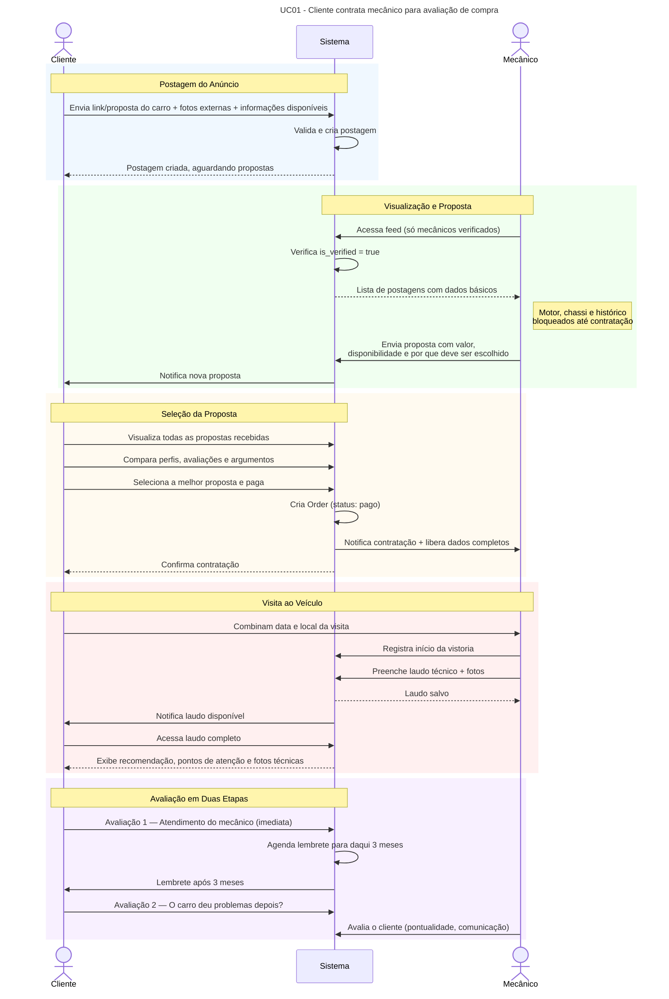
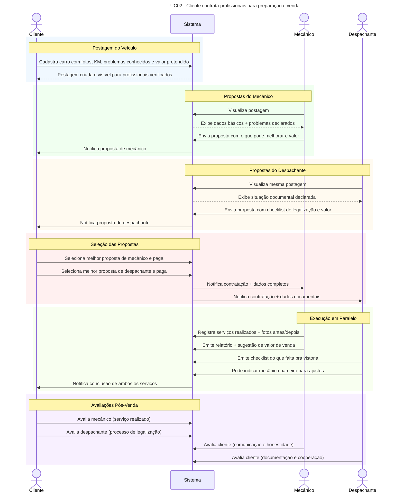
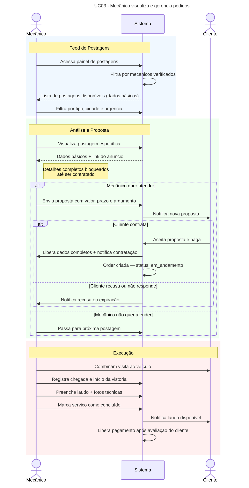
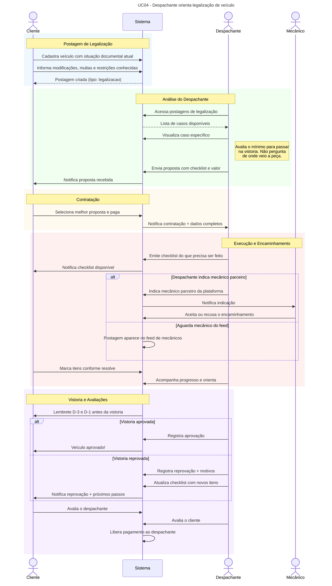

# 🔧 QueMecânicoMeu

> _"Cedo ou tarde o mecânico aparece, você escolhe quando"_

---

Você já comprou um carro usado e descobriu os problemas **depois** de assinar? Você já se sentiu lesado por uma compra que parecia ótima no anúncio? Você já quis ter um **amigo mecânico** do seu lado na hora de fechar negócio?

O **QueMecânicoMeu** é a plataforma que conecta compradores, vendedores e mecânicos verificados para avaliação, preparação e legalização de veículos. O cliente posta o carro ou o link do anúncio, mecânicos verificados enviam propostas explicando por que devem ser escolhidos, e juntos vão até o veículo antes de qualquer decisão ser tomada.

Os detalhes técnicos do laudo só são revelados após a contratação — protegendo o trabalho do mecânico e garantindo que ninguém use a plataforma só pra espionar o carro do vizinho.

---

## 👨‍💻 Autor

**Lucas Eduardo Aurelio** Curso de Tecnologia em Sistemas para Internet — UTFPR Guarapuava Disciplina: TSI35D — Desenvolvimento de Aplicações Backend com Framework - Professor Dr. Andres Jessé Porfirio

---

## 🛠️ Stack Tecnológica

### Backend

- **PHP 8.3**
- **Laravel 12** — Framework principal
- **MySQL** — Banco de dados relacional
- **Laravel Sanctum** — Autenticação
- **Spatie Laravel-Permission** — Sistema de roles
- **Spatie Media Library** — Upload de fotos do veículo
- **Laravel Notifications** — Notificações por email e banco

### Frontend Web

- **Blade** — Template engine
- **TailwindCSS** — Estilização
- **Livewire** — Componentes reativos sem JavaScript

### Mobile

- **NativePHP** — Laravel empacotado como app mobile nativo _(escolha técnica absolutamente séria e não tem nada a ver com ser hilário dizer que o app mobile foi feito em PHP)_

### Infra & DevOps

- **Docker + Laravel Sail** — Ambiente de desenvolvimento
- **GitHub Actions** — Pipeline CI/CD
- **Render** — Deploy em produção
- **Neon.tech** — PostgreSQL em nuvem

---

## 👥 Roles do Sistema

|Role|Quem é|O que pode fazer|
|---|---|---|
|`admin`|Equipe QueMecânicoMeu|Tudo. Aprovar/reprovar profissionais|
|`client`|CPF ou CNPJ|Postar veículos, contratar profissionais, avaliar|
|`mechanic`|Mecânico verificado|Ver postagens, enviar propostas, emitir laudos, avaliar clientes|
|`dispatcher`|Despachante verificado|Ver postagens, emitir checklist de legalização, indicar mecânicos parceiros|

> ⚠️ Mecânicos e despachantes passam por verificação manual antes de serem ativados. Sem verificação o role existe mas o acesso às postagens é bloqueado — eliminando o incentivo de se cadastrar como mecânico só pra bisbilhotar os carros alheios.

---

## 🔐 Proteção contra Mecânicos Falsos

O maior risco da plataforma é alguém se cadastrar como mecânico apenas para ver fotos e dados dos veículos — seja um curioso, um concorrente ou um golpista.

**Camadas de proteção:**

```
1. Verificação manual pelo admin antes de ativar o acesso
2. Postagens visíveis APENAS para profissionais verificados (is_verified = true)
3. Fotos de motor, chassi e documentos bloqueadas até contratação paga
4. Profissional vê apenas: link do anúncio, cidade e foto externa
5. Rate limiting de visualizações por profissional
6. Log de acesso — admin vê quem visualizou sem nunca contratar
7. Mecânico que visualiza muito e nunca contrata entra em revisão automática
```

```php
// Middleware de acesso
if (!auth()->user()->hasRole(['mechanic', 'dispatcher']) ||
    !auth()->user()->is_verified) {
    abort(403, 'Acesso restrito a profissionais verificados.');
}
```

---

## 📊 Diagramas de Sequência

### UC01 — Cliente contrata mecânico para COMPRAR um carro



---

### UC02 — Cliente contrata mecânico e despachante para VENDER um carro



---

### UC03 — Mecânico gerencia pedidos



---

### UC04 — Despachante orienta legalização



---

## 🗃️ Modelo de Dados

#### `users`

|Campo|Tipo|Descrição|
|---|---|---|
|id|bigint PK||
|name|string||
|email|string unique||
|password|string||
|document|string|CPF ou CNPJ|
|document_type|enum|cpf, cnpj|
|phone|string nullable||
|avatar|string nullable||
|is_verified|boolean default false|Verificação manual pelo admin|
|verified_at|timestamp nullable||
|rating_avg|decimal nullable|Média de avaliações|
|created_at / updated_at|timestamp||

---

#### `vehicles`

|Campo|Tipo|Descrição|
|---|---|---|
|id|bigint PK||
|user_id|bigint FK|Dono do veículo|
|brand|string|Marca|
|model|string|Modelo|
|year|int|Ano de fabricação|
|year_model|int|Ano do modelo|
|color|string||
|plate|string nullable|Placa (privado)|
|km|int nullable|Quilometragem|
|fuel|enum|flex, gasolina, diesel, eletrico|
|transmission|enum|manual, automatico, cvt|
|description|text nullable||
|created_at / updated_at|timestamp||

---

#### `posts`

|Campo|Tipo|Descrição|
|---|---|---|
|id|bigint PK||
|user_id|bigint FK|Quem postou|
|vehicle_id|bigint FK nullable|Veículo próprio (venda/legalização)|
|listing_url|string nullable|Link do anúncio externo (compra)|
|type|enum|avaliacao_compra, preparacao_venda, legalizacao|
|title|string||
|description|text|Situação atual|
|city|string||
|state|string||
|urgency|enum|baixa, media, alta|
|budget|decimal nullable||
|status|enum|aberto, em_negociacao, contratado, concluido, cancelado|
|expires_at|timestamp nullable||
|created_at / updated_at / deleted_at|timestamp||

---

#### `proposals`

|Campo|Tipo|Descrição|
|---|---|---|
|id|bigint PK||
|post_id|bigint FK||
|professional_id|bigint FK||
|message|text|Por que deve ser escolhido|
|price|decimal||
|estimated_days|int||
|status|enum|pendente, aceita, recusada, expirada|
|expires_at|timestamp||
|created_at / updated_at|timestamp||

---

#### `orders`

|Campo|Tipo|Descrição|
|---|---|---|
|id|bigint PK||
|post_id|bigint FK||
|proposal_id|bigint FK||
|client_id|bigint FK||
|professional_id|bigint FK||
|type|enum|avaliacao_compra, preparacao_venda, legalizacao|
|status|enum|pago, em_andamento, concluido, cancelado, disputado|
|price|decimal||
|platform_fee|decimal|Taxa 10%|
|professional_amount|decimal|Valor líquido|
|paid_at / started_at / completed_at|timestamp nullable||
|created_at / updated_at|timestamp||

---

#### `reports`

|Campo|Tipo|Descrição|
|---|---|---|
|id|bigint PK||
|order_id|bigint FK unique||
|professional_id|bigint FK||
|type|enum|laudo_compra, relatorio_venda, checklist_legal|
|summary|text|Resumo executivo|
|recommendation|enum|aprovado, aprovado_ressalvas, reprovado, em_andamento|
|details|json|Itens verificados|
|created_at / updated_at|timestamp||

---

#### `report_items`

|Campo|Tipo|Descrição|
|---|---|---|
|id|bigint PK||
|report_id|bigint FK||
|category|string|Motor, Suspensão, Lataria...|
|item|string|Item verificado|
|status|enum|ok, atencao, critico, nao_verificado|
|observation|text nullable||
|created_at / updated_at|timestamp||

---

#### `reviews`

Sistema de avaliação em duas etapas para compras.

|Campo|Tipo|Descrição|
|---|---|---|
|id|bigint PK||
|order_id|bigint FK||
|reviewer_id|bigint FK||
|reviewed_id|bigint FK||
|stage|enum|imediata, pos_3_meses|
|rating|tinyint|1 a 5|
|comment|text nullable||
|problems_reported|boolean nullable|Carro deu problemas? (só pos_3_meses)|
|scheduled_for|timestamp nullable|Lembrete agendado|
|created_at|timestamp||

---

#### `dispatcher_checklists`

|Campo|Tipo|Descrição|
|---|---|---|
|id|bigint PK||
|order_id|bigint FK||
|item|string|O que precisa ser feito|
|status|enum|pendente, em_andamento, concluido|
|priority|enum|baixa, media, alta, critica|
|observation|text nullable||
|mechanic_referral_id|bigint FK nullable|Mecânico indicado pelo despachante|
|completed_at|timestamp nullable||
|created_at / updated_at|timestamp||

---

## 🗺️ Diagrama de Entidades

```
User (1) ──── (N) Vehicle
User (1) ──── (N) Post
User (1) ──── (N) Proposal
User (1) ──── (N) Order como client
User (1) ──── (N) Order como professional
User (1) ──── (N) Review como reviewer
User (1) ──── (N) Review como reviewed

Post (1) ──── (1) Vehicle (opcional)
Post (1) ──── (N) PostPhoto
Post (1) ──── (N) Proposal
Post (1) ──── (N) Order

Order (1) ──── (1) Report
Report (1) ──── (N) ReportItem
Order (1) ──── (N) DispatcherChecklist
Order (1) ──── (N) Review
```

---

## 📋 Módulos do Laravel Aplicados

|#|Módulo|Aplicação no projeto|
|---|---|---|
|04|Roteamento|Grupos de rota por role (guest, client, mechanic, dispatcher, admin)|
|05|Blade|Feed de postagens, laudo, painel do profissional|
|06|TailwindCSS|Estilização completa|
|07|Validação|Formulários de veículo, proposta, laudo e checklist|
|08|Autenticação|Login + verificação de role em cada rota|
|09|Migrations/Eloquent|Todos os relacionamentos acima|
|10|Testes|Testes do fluxo de contratação, liberação de acesso e avaliação em 2 etapas|
|11|Policies|Cliente só vê seus veículos, profissional só vê seus laudos|
|12|Upload de Arquivos|Fotos do veículo com controle de visibilidade por is_public|
|13|Laravel Dusk|Testes E2E do fluxo completo de contratação|
|14|GitHub Actions|CI com testes a cada push|
|15|Deploy CD|Deploy no Render via webhook|

---

## 🚀 Como rodar localmente

```bash
git clone https://github.com/seu-usuario/quemecaniccomeu
cd quemecaniccomeu
cp .env.example .env
./vendor/bin/sail up -d
./vendor/bin/sail composer install
./vendor/bin/sail artisan key:generate
./vendor/bin/sail artisan migrate --seed
```

**Usuários do seeder:**

```
Admin:        admin@quemecaniccomeu.com      / password
Cliente:      cliente@quemecaniccomeu.com    / password
Mecânico:     mecanico@quemecaniccomeu.com   / password (verificado)
Despachante:  despachante@quemecaniccomeu.com / password (verificado)
```

---

## 📱 Sobre o App Mobile (NativePHP)

O app mobile foi desenvolvido com **NativePHP** — tecnologia que empacota uma aplicação Laravel como app nativo para Android e iOS.

A escolha foi puramente técnica e não tem absolutamente nada a ver com ser a coisa mais engraçada que um desenvolvedor PHP pode colocar no currículo.

```bash
php artisan native:run android
php artisan native:run ios
```

> ⚠️ NativePHP Mobile está em versão beta. A decisão de usá-lo em produção é sua e de Deus.

---

## ⚠️ Disclaimer

Projeto desenvolvido para fins **estritamente educacionais** como trabalho da disciplina TSI35D da UTFPR.

A plataforma conecta clientes a profissionais autônomos. O **QueMecânicoMeu** não se responsabiliza pelo resultado das vistorias, laudos emitidos ou orientações de despachantes. Cada profissional é responsável pelo serviço prestado.

Sobre o modo "preparação para venda": a plataforma oferece serviços legítimos de preparação estética e mecânica. O que vendedor e mecânico combinam presencialmente é responsabilidade exclusiva das partes. A plataforma não pergunta de onde veio a peça.

---

## 📄 Licença

MIT License — pode usar, pode copiar, só não compra carro sem vistoria.